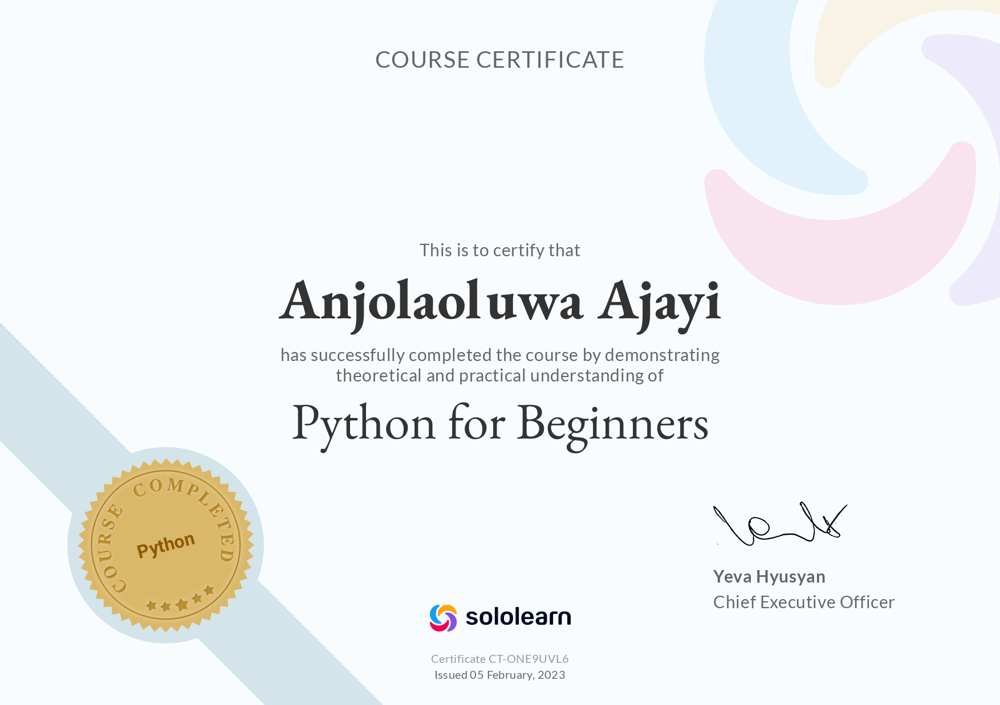
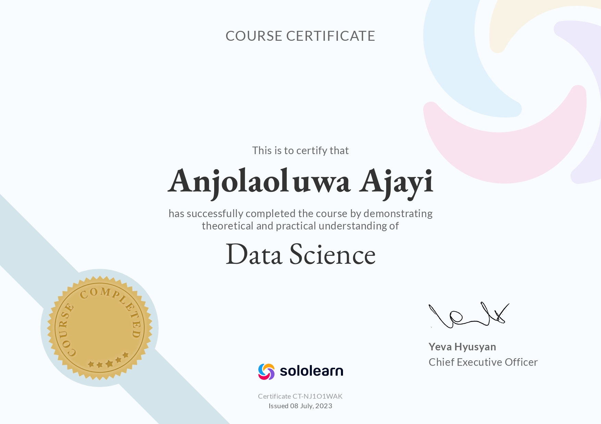

  

    <a href="#home">Home</a>
    <a href="#certifications">Certifications</a>
    <a href="#projects">Projects</a>
  

  
# WELCOME TO MY PORTFOLIO
## About Me:
Hello, I'm Anjolaoluwa Ajayi.

As a neat freak, I often find myself cleaning a lot of things. Be it spilled juice, a dirty floor, a dusty window, or dare I say it, DATA. 

But of all the things I've cleaned my whole life, data is probably my favorite. Because after cleaning a floor or something, all I can do is stare at it and wait till it gets dirty again. But with data, I can do much more than cleaning it.

I can transform data into meaningful stories and visuals that drive impactful decisions, I can use data to build robust models that solve complex problems, and you may like this one, I can also leverage data to improve your business's success.

So I invite you to explore my [projects](#projects) to find out how!

## Education:
- Bachelor of Science in Computer Science, Babcock University, CGPA: 4.86
- Machine Learning Specialization, Stanford University (online)

## Skills:

  Data Analysis
  Data Visualization
  Machine Learning
  Data Cleaning
  Data manipulation
  Supervised learning
  Web scraping
  Unsupervised learning
  Exploratory Data Analysis
  Data Storytelling
  Sentiment Analysis
  Classification
  Regression
  Predictive Analysis
  Error handling
  Reinforcement Learning

## Projects

  

    <a href="#data-analysis">Data Analysis</a>
    <a href="#data-viz">Data Viz</a>
    <a href="#machine-learning">ML</a>
    <a href="#nlp">NLP</a>
  

### Data Analysis

This section showcases my data analysis projects.

### Data Viz

This section showcases my data visualization projects.

### Machine Learning

This section showcases my machine learning projects.

### Natural Language Processing

This section showcases my natural language processing projects.

Feel free to explore different sections of my portfolio using the menu above.

## Certifications

  

    

      
      

        <strong>Intro to Machine learning</strong>
        
RandomForest | DecisionTree | Pandas | Modeling | Optimization

      

      <a href="https://www.kaggle.com/learn/certification/anjolaoluwaajayi/intro-to-machine-learning" target="_blank" class="show-button">View Credential</a>
    

  

  

    

      
      

        <strong>Data Analysis with Python</strong>
        
Data cleaning | Manipulation | Visualization

      

      <a href="https://freecodecamp.org/certification/lifewjola/data-analysis-with-python-v7" target="_blank" class="show-button">View Credential</a>
    

  

  

    

      
      

        <strong>Python for Beginners</strong>
        
Skills gained:

      

      <a href="https://www.sololearn.com/Certificate/CT-ONE9UVL6/png" target="_blank" class="show-button">View Credential</a>
    

  

  

    

      
      

        <strong>Introduction to Python</strong>
        
Python programming language

      

      <a href="https://www.kaggle.com/learn/certification/anjolaoluwaajayi/intro-to-machine-learning" target="_blank" class="show-button">View Credential</a>
    

  

  

    

      
      

        <strong>Data Science</strong>
        
Skills gained:

      

      <a href="https://www.sololearn.com/certificates/CT-NJ1O1WAK" target="_blank" class="show-button">View Credential</a>
    

  

## Contact

If you have any questions or want to get in touch with me, please feel free to reach out via email at example@example.com.

